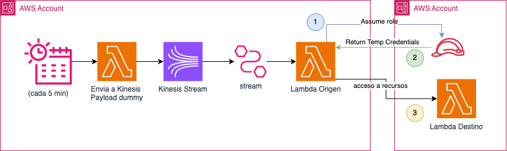

# Comunicación entre Lambdas en Cuentas Diferentes con AWS CDK

Este repositorio proporciona un ejemplo de cómo habilitar la comunicación entre dos funciones AWS Lambda ubicadas en diferentes cuentas de AWS. La solución se implementa utilizando AWS CDK con JavaScript y funciones Lambda escritas en Python.

## Descripción de la Arquitectura

La arquitectura de esta solución se muestra a continuación:



1. **Disparador de Evento**: Un scheduler activa una función Lambda cada 5 minutos.
2. **Kinesis Stream**: La función Lambda activada envía un payload dummy a un stream de Amazon Kinesis.
3. **Lambda Origen**: El stream de Kinesis invoca una función Lambda en la cuenta de AWS de origen.
4. **Asunción de Rol Cross-Account**: La función Lambda en la cuenta de origen asume un rol en la cuenta de destino de AWS y obtiene credenciales temporales.
5. **Lambda Destino**: Usando estas credenciales temporales, la función Lambda en la cuenta de origen se comunica con una función Lambda en la cuenta de destino.

## Requisitos Previos

- AWS CDK instalado en tu máquina local.
- Node.js instalado en tu máquina local.
- Python 3.8 o superior instalado en tu máquina local.
- AWS CLI configurado con acceso a ambas cuentas de AWS.

## Configuración

### 1. Clonar el Repositorio

```bash
git clone https://github.com/tu-repo-nombre.git
cd tu-repo-nombre
```

### 2. Instalar Dependencias

Navega al directorio del proyecto CDK e instala las dependencias necesarias:

```bash
npm install
```

### 3. Bootstrap de tu Entorno AWS

Si aún no has hecho bootstrap de tu entorno AWS para CDK, ejecuta:

```bash
cdk bootstrap aws://ID_CUENTA/REGION
```

Asegúrate de reemplazar `ID_CUENTA` y `REGION` con el ID de tu cuenta y región específicos.

### 4. Desplegar el Stack de CDK

Despliega el stack de CDK en ambas cuentas, origen y destino:

```bash
cdk deploy
```
<p style="background-color: lightblue;">Debes desplegar la infraestructura en 2 cuentas de aws diferentes</p>


### 5. Implementación de las Funciones Lambda

Las funciones Lambda están implementadas en Python y se pueden encontrar en el directorio `lambda/`. Cada función está diseñada para realizar lo siguiente:

- **Lambda Origen**: Envía datos al stream de Kinesis y asume el rol cross-account.
- **Lambda Destino**: Recibe los datos y realiza un procesamiento adicional.

## Consideraciones de Seguridad

- Asegúrate de que los roles de IAM tengan los permisos mínimos necesarios.
- Utiliza métodos seguros para almacenar y gestionar las credenciales temporales.

## Limpieza

Para eliminar los recursos creados por este stack:

```bash
cdk destroy
```

Asegúrate de eliminar los recursos en ambas cuentas, origen y destino.

## Licencia

Este proyecto está licenciado bajo la Licencia MIT.
